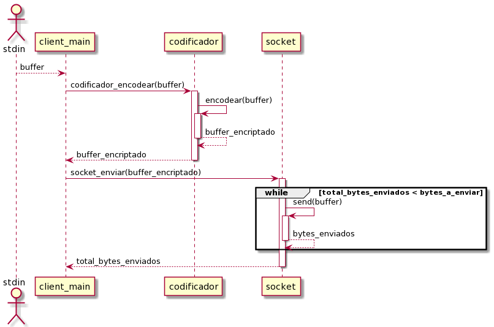
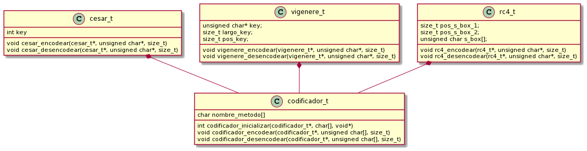

# TP1

Nombre completo: Sebastian Bento Inneo Veiga

Padron: 100998

Link: https://github.com/SBen-IV/tp1

## Descripción

El trabajo práctico presentado corresponde a un programa que puede crear un servidor que recibe bytes y un cliente que puede enviar bytes. El paso de los bytes del cliente al servidor se realiza a través de alguna de las 3 encriptaciones: cesar, vigenere o rc4.

Uno de los problemas que surgieron en la implementación fue cómo hacer que el cliente pudiera tomar el mensaje que se le pasa, encriptarlo y mandarlo sin que estuvieran metidas las dependencias unas con otras. La solución fue que el cliente se encargara de recibir y sea intermediario entre el codificador y el socket de tal forma que codificador no necesite conocer al socket ni viceversa como se puede apreciar en el diagrama de secuencia a continuación:

El cliente obtiene el mensaje que quiere enviar de stdin, se lo pasa a codificador para que lo encripte. Un vez terminada la encriptación el mensaje vuelve al cliente y este se encarga de llamar a `socket_enviar` con el mensaje ya encriptado.

Otra problemática presentada fue la de unificar los distintos tipos de encriptaciones por lo que se recurrió a hacer una estructura llamada `codificador` que se encargara de manejar las encriptaciones. De esta forma, el cliente no tendría que tener presente en todo momento qué encriptación utilizar. A su vez, `codificador` se abstrae de cada encriptación en especídifico al tener cada una su propio `struct` con los miembros necesarios para realizar la encriptación. Se puede observar en el siguiente diagrama cómo están compuestos los struct:

De esta forma se pudieron manejar 2 de las problemáticas presentadas en la implementación dada.